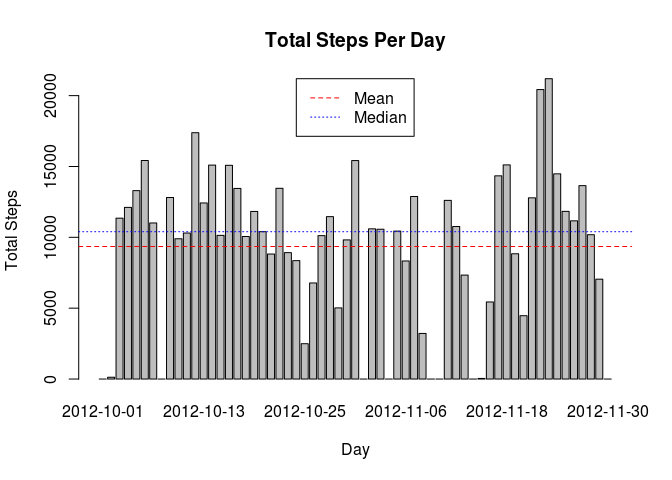
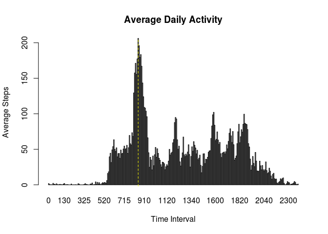
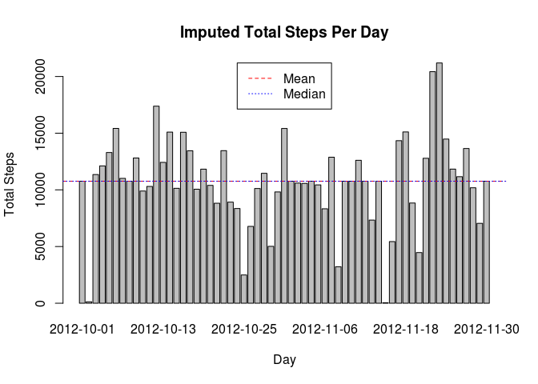
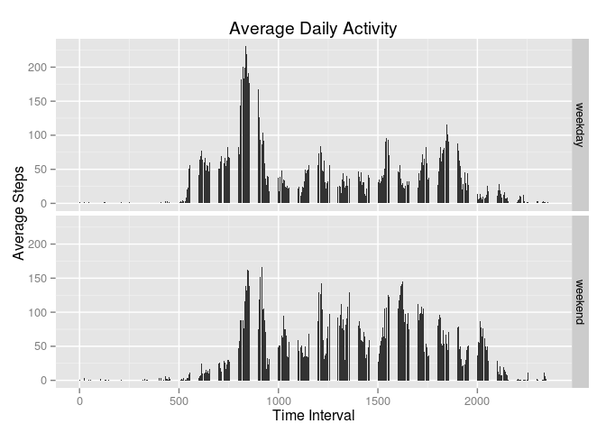
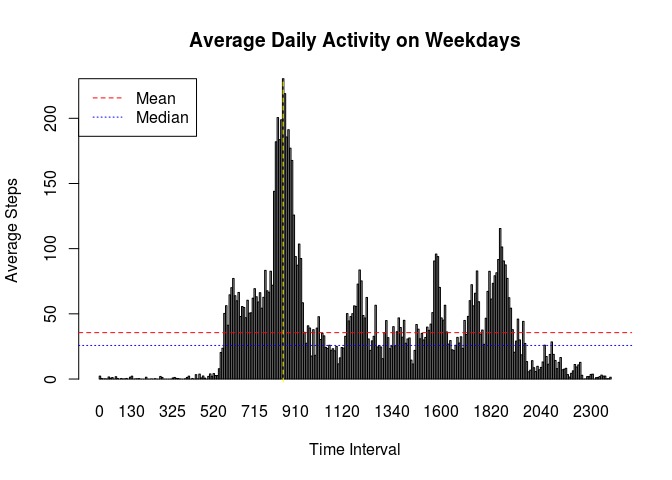
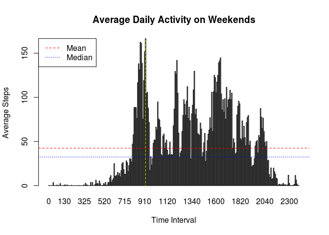

# Reproducible Research: Peer Assessment 1


## Loading and preprocessing the data

```r
activity <- read.csv("activity.csv")
activity$date <- as.Date(activity$date)
```
## What is mean total number of steps taken per day?

```r
plotdata <- tapply(activity$steps, activity$date, FUN = sum, na.rm=TRUE)

barplot(plotdata, xlab = "Day", ylab="Total Steps")
title("Total Steps Per Day")
abline(h=mean(plotdata), col="red", lty=2)
abline(h=median(plotdata), col="blue", lty=3)
legend("top", c("Mean", "Median"), col=c("red", "blue"), lty =c(2,3))
```

 

```r
mean(plotdata)
```

```
## [1] 9354.23
```

```r
median(plotdata)
```

```
## [1] 10395
```
## What is the average daily activity pattern?

```r
plotdata <- aggregate(steps ~ interval, activity, mean, na.rm = TRUE)
mp <- barplot(plotdata$steps, names=plotdata$interval, 
        xlab="Time Interval", ylab="Average Steps")
mostSteps <- which.max(plotdata$steps)
abline(v = mp[mostSteps], col="yellow", lty=2)
title("Average Daily Activity")
```

 

### The most activity is at 8:35 in the morning

```r
plotdata$interval[mostSteps]
```

```
## [1] 835
```
## Imputing missing values

```r
sum(!complete.cases(activity))
```

```
## [1] 2304
```

```r
averageSteps <- merge(activity, plotdata, by="interval")
averageSteps[!complete.cases(averageSteps), 2] <- averageSteps[!complete.cases(averageSteps), 4]
plotdata <- tapply(averageSteps$steps.x, averageSteps$date, FUN = sum, na.rm=TRUE)

barplot(plotdata, xlab = "Day", ylab="Total Steps")
title("Imputed Total Steps Per Day")
abline(h=mean(plotdata), col="red", lty=2)
abline(h=median(plotdata), col="blue", lty=3)
legend("top", c("Mean", "Median"), col=c("red", "blue"), lty =c(2,3))
```

 

```r
mean(plotdata)
```

```
## [1] 10766.19
```

```r
median(plotdata)
```

```
## [1] 10766.19
```
### The mean and the median are now equal and slightly larger than the mean and median calculated for the original data.

## Are there differences in activity patterns between weekdays and weekends?

```r
averageSteps$day <- ifelse(grepl("^S", weekdays(averageSteps$date)), "weekend", "weekday")
averageSteps$day <- factor(averageSteps$day)
plotdata <- aggregate(steps.x ~ interval + day, averageSteps, mean)

library(ggplot2)
p <- ggplot(data=plotdata, aes(x=interval, y=steps.x))
p <- p + ggtitle("Average Daily Activity")
p <- p + labs(x= "Time Interval", y = "Average Steps")
p <- p + geom_bar(stat="identity")
p <- p + facet_grid(day ~ .)
p
```

 

### Weekdays have a peak of activity at 8:35, but less total activity throughout the day.

```r
weekday <- subset(plotdata, day == "weekday")
barplot(weekday$steps.x, names=weekday$interval, xlab="Time Interval", ylab="Average Steps")
abline(h=mean(weekday$steps.x), col="red", lty=2)
abline(h=median(weekday$steps.x), col="blue", lty=3)
legend("topleft", c("Mean", "Median"), col=c("red", "blue"), lty =c(2,3))
mostSteps <- which.max(weekday$steps.x)
abline(v = mp[mostSteps], col="yellow", lty=2)
title("Average Daily Activity on Weekdays")
```

 

### The most activity is at 8:35 in the morning

```r
weekday$interval[mostSteps]
```

```
## [1] 835
```

```r
mean(weekday$steps.x)
```

```
## [1] 35.61058
```

```r
median(weekday$steps.x)
```

```
## [1] 25.80314
```

```r
sum(weekday$steps.x)
```

```
## [1] 10255.85
```

### Weekends have more activity spread throughout the day.

```r
weekend <- subset(plotdata, day == "weekend")
barplot(weekend$steps.x, names=weekend$interval, xlab="Time Interval", ylab="Average Steps")
abline(h=mean(weekend$steps.x), col="red", lty=2)
abline(h=median(weekend$steps.x), col="blue", lty=3)
legend("topleft", c("Mean", "Median"), col=c("red", "blue"), lty =c(2,3))
mostSteps <- which.max(weekend$steps.x)
abline(v = mp[mostSteps], col="yellow", lty=2)
title("Average Daily Activity on Weekends")
```

 

### The most activity is at 9:15 in the morning

```r
weekend$interval[mostSteps]
```

```
## [1] 915
```

```r
mean(weekend$steps.x)
```

```
## [1] 42.3664
```

```r
median(weekend$steps.x)
```

```
## [1] 32.33962
```

```r
sum(weekend$steps.x)
```

```
## [1] 12201.52
```
