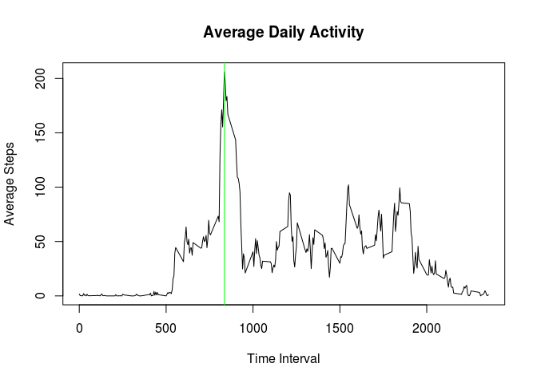
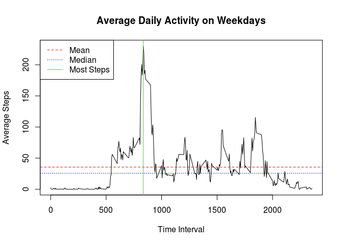
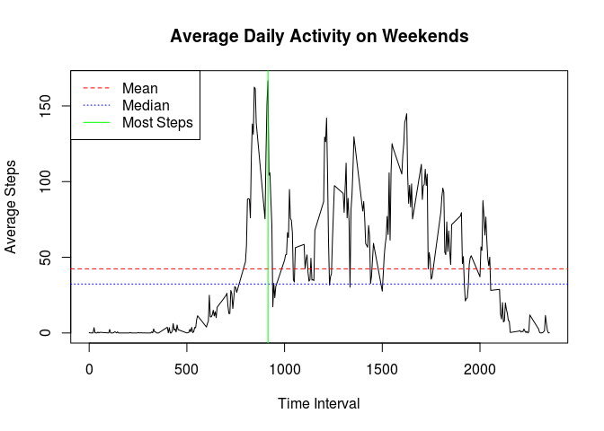
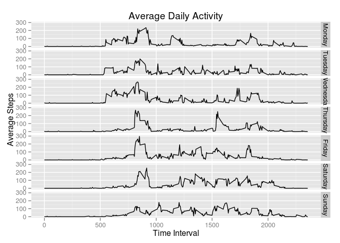

# Reproducible Research: Peer Assessment 1


## Loading and preprocessing the data

```r
activity <- read.csv("activity.csv")
activity$date <- as.Date(activity$date)
```
## What is mean total number of steps taken per day?

```r
plotdata <- tapply(activity$steps, activity$date, FUN = sum, na.rm=TRUE)

barplot(plotdata, xlab = "Day", ylab="Total Steps")
title("Total Steps Per Day")
abline(h=mean(plotdata), col="red", lty=2)
abline(h=median(plotdata), col="blue", lty=3)
legend("top", c("Mean", "Median"), col=c("red", "blue"), lty =c(2,3))
```

 

```r
mean(plotdata)
```

```
## [1] 9354.23
```

```r
median(plotdata)
```

```
## [1] 10395
```
## What is the average daily activity pattern?

```r
plotdata <- aggregate(steps ~ interval, activity, mean, na.rm = TRUE)
plot(plotdata$interval, plotdata$steps, type="l",
        main="Average Daily Activity",
        xlab="Time Interval", ylab="Average Steps")
mostSteps <- plotdata$interval[which.max(plotdata$steps)]
abline(v = mostSteps, col="green", lty=1)
```

 

### The most activity is at 8:35 in the morning

```r
mostSteps
```

```
## [1] 835
```
## Imputing missing values
### Replace missing values with the average number of steps calculated for the corresponding time interval.

```r
sum(!complete.cases(activity))
```

```
## [1] 2304
```

```r
averageSteps <- merge(activity, plotdata, by="interval")
averageSteps[!complete.cases(averageSteps), 2] <- averageSteps[!complete.cases(averageSteps), 4]
plotdata <- tapply(averageSteps$steps.x, averageSteps$date, FUN = sum, na.rm=TRUE)

barplot(plotdata, xlab = "Day", ylab="Total Steps")
title("Imputed Total Steps Per Day")
abline(h=mean(plotdata), col="red", lty=2)
abline(h=median(plotdata), col="blue", lty=3)
legend("top", c("Mean", "Median"), col=c("red", "blue"), lty =c(2,3))
```

 

```r
mean(plotdata)
```

```
## [1] 10766.19
```

```r
median(plotdata)
```

```
## [1] 10766.19
```
### The mean and the median are now equal and slightly larger than the mean and median calculated for the original data.

## Are there differences in activity patterns between weekdays and weekends?

```r
averageSteps$day <- ifelse(grepl("^S", weekdays(averageSteps$date)),
                           "weekend", "weekday")

averageSteps$day <- factor(averageSteps$day)

plotdata <- aggregate(steps.x ~ interval + day, averageSteps, mean)

library(ggplot2)
p <- ggplot(data=plotdata, aes(x=interval, y=steps.x))
p <- p + ggtitle("Average Daily Activity")
p <- p + labs(x= "Time Interval", y = "Average Steps")
p <- p + geom_line()
p <- p + facet_grid(day ~ .)
p
```

 

### Weekdays have a peak of activity at 8:35, but less total activity throughout the day.

```r
weekday <- subset(plotdata, day == "weekday")
plot(weekday$interval, weekday$steps.x, type="l",
     main="Average Daily Activity on Weekdays", 
     xlab="Time Interval", ylab="Average Steps")
abline(h=mean(weekday$steps.x), col="red", lty=2)
abline(h=median(weekday$steps.x), col="blue", lty=3)
legend("topleft", c("Mean", "Median", "Most Steps"), 
       col=c("red", "blue", "green"), lty =c(2,3, 1))
mostSteps = weekday$interval[which.max(weekday$steps.x)]
abline(v = mostSteps, col="green", lty=1)
```

 

### The most activity is at 8:35 in the morning

```r
mostSteps
```

```
## [1] 835
```

```r
mean(weekday$steps.x)
```

```
## [1] 35.61058
```

```r
median(weekday$steps.x)
```

```
## [1] 25.80314
```

```r
sum(weekday$steps.x)
```

```
## [1] 10255.85
```

### Weekends have more activity spread throughout the day.

```r
weekend <- subset(plotdata, day == "weekend")
plot(weekend$interval, weekend$steps.x, type = "l",
        main="Average Daily Activity on Weekends", 
        xlab="Time Interval", ylab="Average Steps")
abline(h=mean(weekend$steps.x), col="red", lty=2)
abline(h=median(weekend$steps.x), col="blue", lty=3)
legend("topleft", c("Mean", "Median", "Most Steps"), 
       col=c("red", "blue", "green"), lty =c(2,3, 1))
mostSteps = weekend$interval[which.max(weekend$steps.x)]
abline(v = mostSteps, col="green", lty=1)
```

 

### The most activity is at 9:15 in the morning

```r
mostSteps
```

```
## [1] 915
```

```r
mean(weekend$steps.x)
```

```
## [1] 42.3664
```

```r
median(weekend$steps.x)
```

```
## [1] 32.33962
```

```r
sum(weekend$steps.x)
```

```
## [1] 12201.52
```

## It's interesting to compare activity throughout the week.

```r
averageSteps$day <- weekdays(averageSteps$dat)
averageSteps$day <- factor(averageSteps$day, ordered=TRUE,
   levels=c("Monday", "Tuesday", "Wednesday", "Thursday", "Friday", 
            "Saturday", "Sunday"))

plotdata <- aggregate(steps.x ~ interval + day, averageSteps, mean)

library(ggplot2)
p <- ggplot(data=plotdata, aes(x=interval, y=steps.x))
p <- p + ggtitle("Average Daily Activity")
p <- p + labs(x= "Time Interval", y = "Average Steps")
p <- p + geom_line()
p <- p + facet_grid(day ~ .)
p
```

 

```r
aggregate(steps.x ~ day, plotdata, sum)
```

```
##         day   steps.x
## 1    Monday 10150.709
## 2   Tuesday  8949.556
## 3 Wednesday 11676.910
## 4  Thursday  8496.465
## 5    Friday 12005.597
## 6  Saturday 12314.274
## 7    Sunday 12088.774
```
